<h1 align="center">Hi 👋, I'm Khoa Tran</h1>

<h3 align="center">
AI Researcher • Medical Vision-Language Models • Adversarial Robustness
</h3>

  

---

## 🔬 Research Interests

  
  
  
  

---

## 📈 GitHub Activity

  

---

## 🐍 Contribution Graph

  

---

## 🚀 Featured Projects

| Project | Description |
|----------|------------|
| BCOS Attack | Adversarial attacks on interpretable neural networks |
| Medical VLM Benchmark | Robustness evaluation of medical vision-language models |
| Evolutionary Black-box Attack | Query-efficient adversarial optimization |
| Explainability Toolkit | Attribution and explanation methods for multimodal models |

---

## 🎓 Current Research

- Medical Vision-Language Models
- Explainable AI (XAI)
- Adversarial Machine Learning
- Evolutionary Optimization
- Robust Multimodal Systems

---

## 🛠 Languages and Tools

  

  

  

  

  

  

  

  

  

---

## 📫 Connect with Me

  <a href="https://github.com/khoa16122004">GitHub</a> •
  <a href="https://www.linkedin.com/">LinkedIn</a> •
  <a href="mailto:your_email@gmail.com">Email</a>

