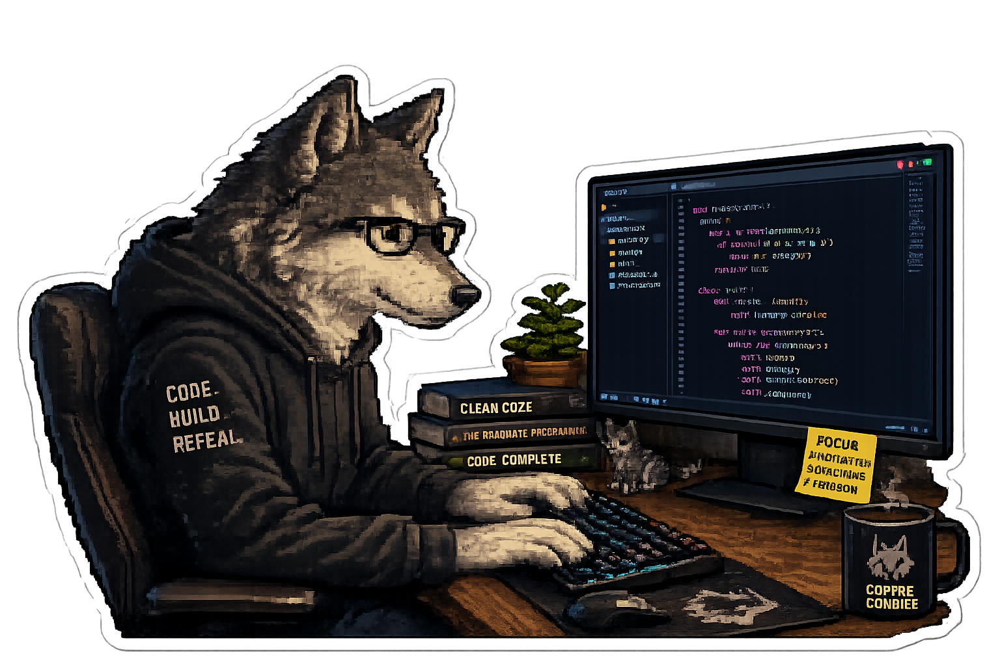

<h1 align="center">Hi 👋, I'm Khoa Tran</h1>

<h3 align="center">
AI Researcher • Medical Vision-Language Models • Adversarial Robustness
</h3>

  

<!-- SCHOLAR-PAPERS:START -->
## Latest Papers

Source: <a href="https://scholar.google.com/citations?user=H8LRCN8AAAAJ&hl=en">Google Scholar via SerpAPI</a>

<ul>
<li><strong>2025</strong> - <a href="https://scholar.google.com/citations?view_op=view_citation&amp;hl=en&amp;user=H8LRCN8AAAAJ&amp;pagesize=5&amp;sortby=pubdate&amp;citation_for_view=H8LRCN8AAAAJ:UeHWp8X0CEIC">Rethinking Adversarial Robustness: The Role of Input Transformations</a> HTM Nguyen, K Tran, QM Phan, NH Luong <em>2025 RIVF International Conference on Computing and Communication …, 2025</em></li>
<li><strong>2025</strong> - <a href="https://scholar.google.com/citations?view_op=view_citation&amp;hl=en&amp;user=H8LRCN8AAAAJ&amp;pagesize=5&amp;sortby=pubdate&amp;citation_for_view=H8LRCN8AAAAJ:qjMakFHDy7sC">Enhancing Endoscopic Image Retrieval via Self-Supervised Learning and Large VLM-Based Re-ranking</a> K Tran, L Ly, DK Ho, NH Luong <em>Proceedings of the 33rd ACM International Conference on Multimedia, 14190-14196, 2025</em></li>
<li><strong>2025</strong> - <a href="https://scholar.google.com/citations?view_op=view_citation&amp;hl=en&amp;user=H8LRCN8AAAAJ&amp;pagesize=5&amp;sortby=pubdate&amp;citation_for_view=H8LRCN8AAAAJ:9yKSN-GCB0IC">Evolutionary Black-box Patch Attacks on Face Verification</a> K Tran, L Ly, NH Luong <em>Proceedings of the Genetic and Evolutionary Computation Conference Companion …, 2025</em></li>
<li><strong>2024</strong> - <a href="https://scholar.google.com/citations?view_op=view_citation&amp;hl=en&amp;user=H8LRCN8AAAAJ&amp;pagesize=5&amp;sortby=pubdate&amp;citation_for_view=H8LRCN8AAAAJ:d1gkVwhDpl0C">Addressing ambiguous queries in video retrieval with advanced temporal search</a> BT Gia, TBC Khanh, TLT Thanh, K Tran, HH Trong, TT Doan, K Le, T Do, ... <em>International Symposium on Information and Communication Technology, 167-180, 2024</em></li>
<li><strong>2024</strong> - <a href="https://scholar.google.com/citations?view_op=view_citation&amp;hl=en&amp;user=H8LRCN8AAAAJ&amp;pagesize=5&amp;sortby=pubdate&amp;citation_for_view=H8LRCN8AAAAJ:u-x6o8ySG0sC">Adversarial Robustness of Medical Image Classifiers via Denoised Smoothing</a> K Tran, L Ly, NH Luong <em>International Symposium on Information and Communication Technology, 42-56, 2024</em></li>
</ul>

Last successful sync: 2026-06-02T10:27:54.544484+00:00

<!-- SCHOLAR-PAPERS:END -->
